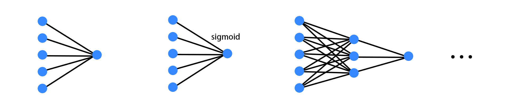
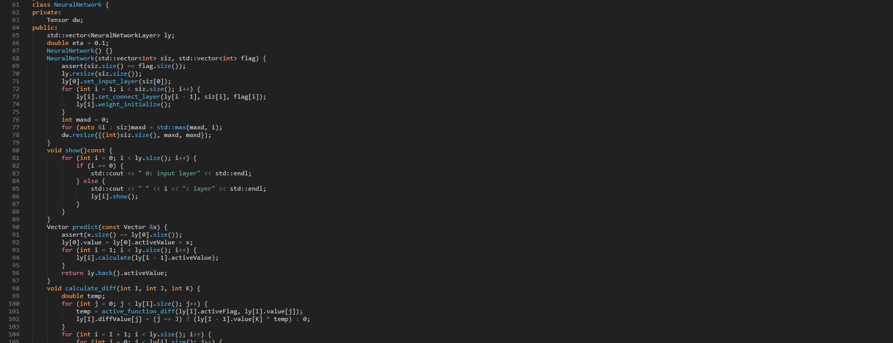
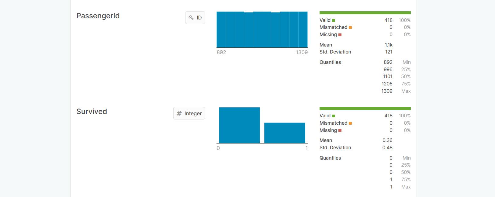
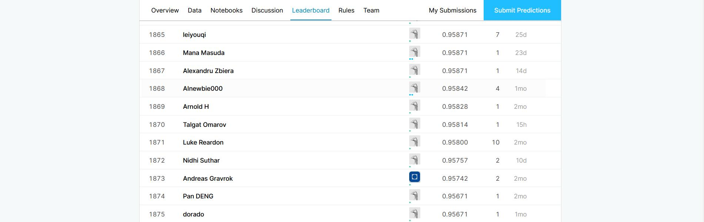
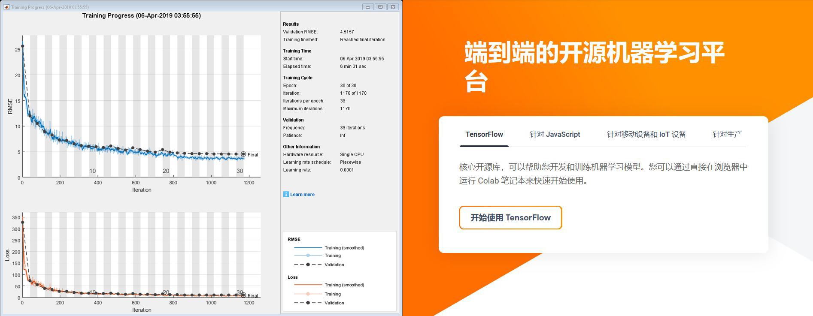

# 神经网络在数据挖掘中的应用
**毕业论文开题答辩**
数学与应用数学163班 段忠杰

---

## 研究内容-理论部分
**各类神经网络的原理**
1. 简单的单层神经网络（多元线性回归、对数几率回归）
2. 含隐层的神经网络（感知机）
3. 结构复杂的神经网络（递归神经网络、卷积神经网络、生成对抗网络等）

**神经网络的相关算法**
1. 梯度下降法
2. BP算法

---

## 研究内容-应用部分
**数据挖掘**
1. kaggle

2. 天池

---

## 研究内容-应用部分
Example

---

## 研究方法
1. 学习机器学习相关的知识，掌握神经网络的原理

---

## 研究方法
2. 利用计算机编程，从原理出发实现简单的神经网络

---

## 研究方法
3. 充分利用 Kaggle 等网站提供的数据，测试神经网络的性能

---

## 研究方法
4. 调整神经网络的结构与参数，提高其效率

---

## 研究方法
5. 使用 Matlab 与 TensorFlow 提供的神经网络框架，复现各种结构复杂的神经网络

---

## 研究方法经网络
6. 尝试自行设计复杂神经网络的结构，来解决数据挖掘中的实际问题
7. 撰写论文，总结研究成果

---

# 恳请各位老师批评指正！
