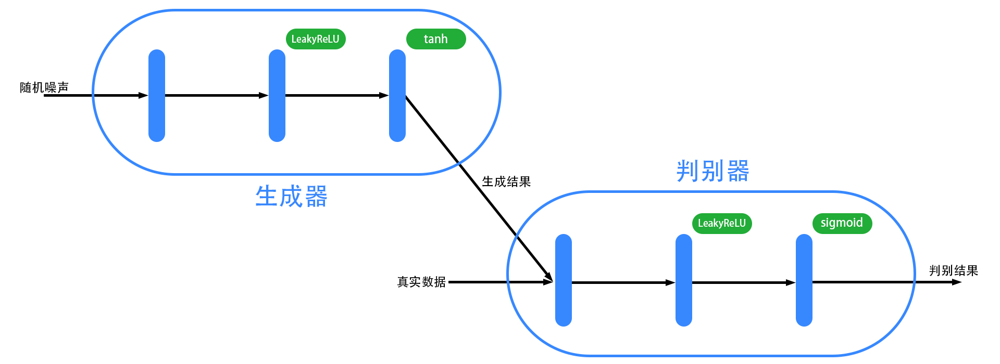
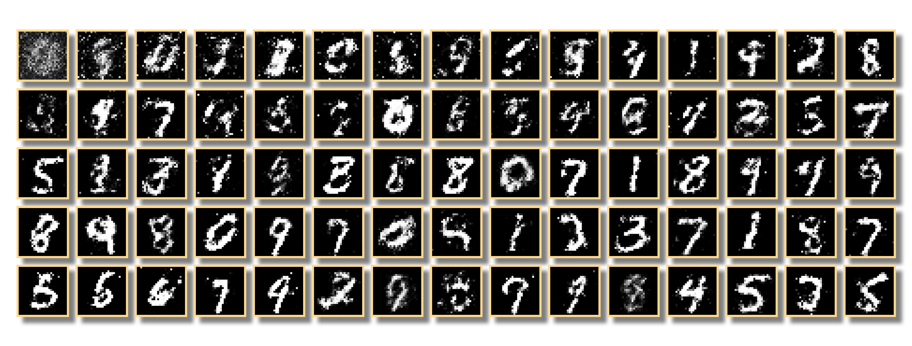

# 神经网络在数据挖掘中的应用

数学与计算机科学学院 数学与应用数学专业 段忠杰（201631700326）

指导老师：向道红（教授）

## 摘要

本文整理介绍了常见的神经网络模型结构，包括多元线性回归、对数几率回归、感知机、卷积神经网络、循环神经网络、长短时记忆网络、生成对抗网络。使用 C++ 语言开发，实现了这些网络结构，并根据手写数字数据集、北京天气数据集构造了相应的网络结构，测试不同网络结构的效果，使用卷积神经网络在手写数字识别问题上达到了 $97\%$ 的准确率，使用长短时记忆网络可以预测短期内气温的变化状况，使用生成对抗网络可以随机生成手写数字图片。另外，本文还介绍了神经网络的优化方法，包括梯度下降法、Adam 算法，以及防止过拟合的 Dropout 方法。

**关键词**：神经网络 数据挖掘 深度学习

## 1 引言

神经网络是一个机器学习算法模型，随着计算机算力的不断提高，研究者们对神经网络模型的研究逐渐深入，神经网络已成为图像识别等领域最热门的算法模型之一，本文将对几种常见的网络结构进行介绍，并在数据挖掘中进行应用。

## 2 线性模型

线性模型可以视为最简单的神经网络，本文将从线性模型开始介绍神经网络模型。

### 2.1 多元线性回归

设有数据集 $\{(x_i,y_i)\}_{i=1}^m$，其中 $x_i=(x_{i1},x_{i2},\cdots,x_{in})^T\in \mathbb{R}^n,y_i\in \mathbb{R}$，$y_i$ 与 $x_i$ 有潜在的关系 $y_i=f(x_i)$，我们的目标就是找到这样的关系 $f$，使得 $\hat{y}_i=f(x_i)$ 与 $y_i$ 的差别尽可能小，也就可以用 $f$ 来对 $y_i$ 进行预测。

（为表述方便，下用 $x,y$ 表示上文中的 $x_i,y_i$）

在**多元线性回归**$^{[1]}$中，假定 $y$ 与 $x=(x_1,x_2,\cdots,x_n)^T$ 的关系是一个线性表达式，即
$$
\hat{y}=\sum_{j=1}^nw_jx_{j}+b
$$
写成向量形式，即
$$
\hat{y}=wx+b
$$
其中 $w=(w_1,w_2,\cdots,w_n)$，称 $w$ 为**权重**，$b$ 为**阈值**。

模型求解的过程分为训练过程和预测过程，训练过程即通过 $x,y$ 求 $w$ 与 $b$，预测过程即通过 $x,w,b$ 求 $\hat{y}$。

### 2.2 对数几率回归（逻辑回归）

在上述问题中，有一类特殊的问题，即二分类问题，若样本属于第一类，记 $y=1$，否则 $y=0$，我们可以认为预测的 $y$ 为样本属于第一类的概率，取值范围为 $[0,1]$，可以对数据属于两类的条件概率的比值进行预测，假设

$$
\ln \frac{P(y=1|x)}{P(y=0|x)}=wx+b
$$
同时显然有
$$
P(y=1|x)+P(y=0|x)=1
$$
解得
$$
P(y=1|x)=\frac{1}{1+e^{-(wx+b)}}
$$

$$
P(y=0|x)=\frac{1}{1+e^{wx+b}}
$$

因此，我们可以用 $\hat{y}=P(y=1|x)=\frac{1}{1+e^{-(wx+b)}}$ 来作为 $y$ 的预测值

定义 **sigmoid 函数**
$$
\text{sigmoid}(x)=\frac{1}{1+e^{-x}}
$$
进而得到**对数几率回归**$^{[1]}$模型的表达式
$$
y=\text{sigmoid}(wx+b)
$$
与多元线性回归类似，模型求解的过程分为训练过程和预测过程，训练过程即通过 $x,y$ 求 $w$ 与 $b$，预测过程即通过 $x,w,b$ 求 $\hat{y}$。

### 2.3 梯度下降法

要进行模型的训练，需要有一个指标来衡量模型参数 $w,b$ 的优劣，也就是损失函数，例如**均方误差**（mean-square error），即
$$
E(y,\hat y)=\frac{1}{2}(\hat{y}-y)^2
$$
显然，损失函数的值越小，$\hat{y}$ 与 $y$ 的差异就越小，模型的效果就越好。

均方误差函数是一个凸函数，因此可以使用**梯度下降法**求解 $w,b$。梯度是函数变化最快的方向，向梯度的反方向移动 $w$ 与 $b$，将会逐渐逼近最优解。因此我们先随机确定 $w^{[0]},b^{[0]}$ ，再以下面的公式进行迭代。
$$
w^{[n+1]}=w^{[n]}-\eta\frac{\partial E}{\partial w^{[n]}}
$$
$$
b^{[n+1]}=b^{[n]}-\eta\frac{\partial E}{\partial b^{[n]}}
$$

在多元线性回归中
$$
\frac{\partial E}{\partial w^{[n]}}=(\hat y-y)x^T
$$

$$
\frac{\partial E}{\partial b^{[n]}}=(\hat y-y)
$$

在对数几率回归中
$$
\frac{\partial E}{\partial w^{[n]}}=(\hat y-y)\hat y(1-\hat y)x^T
$$

$$
\frac{\partial E}{\partial b^{[n]}}=(\hat y-y)\hat y(1-\hat y)
$$

经过若干次迭代后将收敛到最优的 $w,b$。其中 $\eta$ 是常参数，称为学习率，具体数值根据实际问题调整。如果 $\eta$ 的值过小，会导致训练的收敛过程缓慢，如果 $\eta$ 的值过大，可能导致发散。

### 2.4 使用线性模型进行手写数字识别

我们在数据挖掘网站 Kaggle 上获取 MNIST 手写数字识别的部分数据集（https://www.kaggle.com/c/digit-recognizer），该数据集中包含 $42000$ 个数据，每个数据包含 $28\times 28$ 的图像灰度值数据，范围为 $[0,255]$，以及一个标签 $d$，表示图像对应的数字。首先我们将图像的灰度值数据变成一个 $784$ 维的向量，对应线性模型中的 $n=784$，并归一化到范围 $[0,1]$ 内，即
$$
x\leftarrow \frac{x}{255}
$$
然后将整个数据集划分为训练数据集和测试数据集，也就是将整个数据集随机打乱顺序后，将前 $30000$ 个数据作为训练数据集，用来训练模型，后 $12000$ 个数据作为测试数据集，用来测试模型的准确率。

在训练前，将标签转换为 one-hot 编码，即 $y=(y_0,y_1,\cdots,y_9)$，其中 $y_d=1$，其余全部为 $0$；将灰度值除以 $255$，映射到范围 $[0,1]$ 中；用 $10$ 个独立的线性模型来拟合 $y_0,y_1,\cdots,y_9$，在预测时，取
$$
\hat{d}=\arg \max_i \hat{y}_i
$$
作为预测结果；在训练时，每次随机取一个样本数据，用梯度下降法进行迭代。

首先测试多元线性回归，$w$ 与 $b$ 在范围 $[-0.5,0.5]$ 内以均匀分布进行随机初始化，学习率 $\eta=0.001$，训练足够多次后，准确率达到 $83\%$ 左右。


然后测试对数几率回归，$w$ 与 $b$ 在范围 $[-0.5,0.5]$ 内以均匀分布进行随机初始化，学习率 $\eta=0.1$，训练足够多次后，准确率达到 $90\%$ 左右。


为了了解模型的权重分布情况，我们将 $w$ 进行可视化，下图是多元线性回归的权重图，权重越大，对应位置的颜色越亮。


从图中可以看出，在图像边缘部分权重的分布看起来杂乱无章，是因为图像的分类由靠近中心位置的灰度值与权重决定，而边缘部分的权重对分类结果影响较小，很大程度上依赖其随机设定的初始值。

下图是对数几率回归的权重分布图，在这张图中可以隐约看到 $10$ 个数字的轮廓。


多元线性回归与对数几率回归的不同之处在于，对数几率回归在输出前使用了 sigmoid 函数，这个函数在 $0$ 附近斜率较大，更易让参数经过梯度下降法“滑落”到正确分类上，因此在随机初始化参数的前提下，对数几率回归能达到更高的准确率。

## 3. 感知机

我们将线性模型抽象成神经网络模型，线性模型可以视为 $n+1$ 个神经元构成的神经网络，包括 $n$ 个输入神经元构成的输入层，与 $1$ 个输出神经元构成的输出层，每个神经元有输入值和输出值，这些值通过神经网络上的有向边来传递。两个线性模型的唯一不同之处是对数几率回归的输出神经元上添加了 sigmoid 函数。


将线性模型变得稍加复杂一点，在输入层与输出层之间添加隐含层，包含若干个神经元，将输入层、隐含层、输出层的输出值分别记为 $A$、$B$、$C$。输入层与隐含层之间的权重和阈值为 $(W_1,b_1)$，隐含层的每个神经元是输入层神经元输出值的线性组合+该神经元的阈值，即 $B=W_1A+b_1$；隐含层与输出层之间的权重和阈值为 $(W_2,b_2)$，输出层神经元是隐含层神经元输出值的线性组合+该神经元的阈值，即 $C=W_2B+b_2$。当然，输出层可以包含多个神经元，也就可以输出多个值。这样的神经网络模型称为**感知机**。


然而，这样的模型仅仅是在结构上变得复杂了一点，输出的结果仍然是输入值的线性组合+阈值，效果与线性模型无异，为此，需要在隐含层与输出层神经元上添加激活函数 $f,g$，让模型的表达式变成非线性表达式。
$$
B=f(W_1A+b_1),C=g(W_2B+b_2)
$$

### 3.1 激活函数

在对数几率回归中的 sigmoid 函数就是一个激活函数，添加了激活函数的神经元，其输出值为输入值作用激活函数之后的值，常用的激活函数有

| 激活函数       | 函数表达式                               |
| -------------- | ---------------------------------------- |
| sigmoid 函数   | $f(x)=\frac{1}{1+e^{-x}}$                |
| ReLU 函数      | $f(x)=\max(x,0)$                         |
| softmax 函数   | $f(x_i)=\frac{e^{x_i}}{\sum_{j}e^{x_j}}$ |
| tanh 函数      | $f(x)=\frac{e^x-e^{-x}}{x^x+e^{-x}}$     |
| leakyReLU 函数 | $f(x)=\max(x,\alpha x),0\le \alpha <1$   |

### 3.2 损失函数

在线性模型中，我们使用均方误差作为损失函数，来衡量模型参数的优劣，常用的损失函数有

| 损失函数 | 函数表达式                            |
| -------- | ------------------------------------- |
| 均方误差 | $E(y,\hat y)=\frac{1}{2}|y-\hat y|^2$ |
| 绝对误差 | $E(y,\hat y)=|y-\hat y|$              |
| 交叉熵   | $E(y,\hat y)=-y\ln \hat y$            |

其中的交叉熵一般和 softmax 函数用在单分类问题（例如手写数字识别，判断样本属于 $n$ 类中的哪一类）的输出层上，如果分类问题只涉及两类，交叉熵为 $E(y,\hat y)=-y\ln \hat y-(1-y)\ln (1-\hat y)$。

损失函数的不同会影响模型的收敛速度。

### 3.3 误差逆传播算法

对于神经网络模型，在训练过程中，继续使用梯度下降法，考虑到模型结构的复杂性，我们把神经网络抽象成一个有向无环图 $G=(V,E)$，其中 $V$ 是所有神经元的集合，$E$ 是所有有向边的集合，我们可以先计算损失函数对于每个神经元输出值的偏导数，进而求出损失函数对每个权重和阈值的偏导数。

**定义 拓扑排序** 在有向无环图 $G=(V,E)$ 中，设 $P=(u_1,u_2,\cdots,u_n)$ 是顶点集 $V$ 的一个排列，若任意 $<u,v>\in E$，$u$ 在 $P$ 中排在 $v$ 前面，则称 $P$ 是 $G$ 的一个拓扑排序。

模型训练过程是将值沿图的拓扑排序传播，训练过程则需要反向将梯度（偏导数）沿反向图的拓扑排序传播，模型训练过程的伪代码如下：

```python
# 正向传播
对 V 进行拓扑排序
for u in V:
    计算 u 的输出值
    for e = <u, v> in E:
        传递 u 的输出值到 v 的输入值
# 将所有边反向
for e = <u, v> in E:
    e = <v, u> 
# 反向传播
对 V 进行拓扑排序
计算损失函数对输出层神经元输出值的导数值
for u in V:
    for e = <u, v> in E:
        传递 u 的导数值到 v 的导数值
        更新 e 的权重
    更新 u 的阈值（如果有的话）
```

### 3.4 使用单隐层感知机进行手写数字识别

以手写数字识别为例，在隐含层构造 $30$ 个神经元，输出层构造 $10$ 个神经元，在隐含层与输出层上添加 sigmoid 函数作为激活函数，模型包含的参数数量为 $784\times 30+30+30\times 10+10=23860$。所有权重与阈值在范围 $[-0.5,0.5]$ 中以均匀分布随机初始化，学习率 $\eta=0.1$，损失函数取均方误差，经过足够多次迭代后，准确率达到 $94\%$ 左右。


单隐层感知机相比于线性模型，在准确率上有了提升，但是模型的可解释性降低，我们难以通过模型中的权重和阈值来解释模型的训练结果。

理论上隐含层的神经元数量越多，模型能够达到的准确率就越高，但代价是训练时间的增加。

## 4. 卷积神经网络（CNN）

### 4.1 卷积层与池化层

在手写数字识别问题中，我们将数据抽象成了 $784$ 维的向量，而忽略了图像的二维结构，为了解决二维结构问题，我们引入两个特殊的神经网络层——**卷积层**和**池化层**$^{[2]}$。

设图像的宽度为 $w_1$，高度为 $h_1$，那么图像的灰度值可以用矩阵表示
$$
P=\begin{pmatrix}
p_{11}&p_{12}&\cdots&p_{1w_1}\\
p_{21}&p_{22}&\cdots&p_{2w_1}\\
\vdots&\vdots&\ddots&\vdots\\
p_{h_11}&p_{h_12}&\cdots&p_{h_1w_1}
\end{pmatrix}
$$
卷积层包含 $h_2\times w_2$ 的权重矩阵 $C$ 与阈值 $b$
$$
C=\begin{pmatrix}
c_{11}&c_{12}&\cdots&c_{1w_2}\\
c_{21}&c_{22}&\cdots&c_{2w_2}\\
\vdots&\vdots&\ddots&\vdots\\
c_{h_21}&c_{h_22}&\cdots&c_{h_2w_2}
\end{pmatrix}
$$
卷积结果为 $h_3\times w_3(h_3=h_1-h_2+1,w_3=w_1-w_2+1)$ 的矩阵 $A=\{a_{ij}\}_{h_3\times w_3}$，其中
$$
a_{d_1d_2}=\sum_{i=1}^{h_2}\sum_{j=1}^{w_2}p_{d_1+i-1,d_2+j-1}c_{ij}+b
$$
$d_1=1,2,\cdots,h_3;d_2=1,2,\cdots,w_3$。

卷积的过程可以理解为将 $C$ 铺在 $P$ 上，对于重合部分求内积。卷积层可以稍加推广，例如引入步长 $s$，让 $C$ 每次在 $P$ 上移动距离 $s$ 而非原来的 $1$，这在处理大型图片数据时可以进一步压缩图片信息；又比如在原始图像周围填充 $0$ 后再进行卷积，保留更多信息，避免多层卷积后图像变得过小。


卷积层可以将图像某个区域内的信息保留，生成新的二维数据 $A$。

池化层通常连接在卷积层之后，用来解决图像过大的问题，适当缩小图像的尺寸，减少算力的消耗。常见的有最大值池化层，最大值池化层不含权重与阈值，它在二维数据的大小为 $h_4\times w_4$ 的区域内取最大值，这些最大值构成大小为 $h_5\times w_5(h_5=\frac{h_3}{h_4},w_5=\frac{w_3}{w_4})$ 的二维数据 $M=\{m_{ij}\}_{h_5\times w_5}$，其中
$$
m_{d_1d_2}=\max_{i=1,2,\cdots,h_4;j=1,2,\cdots,w_4}a_{(d_1-1)h_4+i,(d_2-1)w_4+j}
$$
（注：这里默认 $h_5=\frac{h_3}{h_4},w_5=\frac{w_3}{w_4}$ 是整数，如果不是，那就向下取整，但因此会损失一部分数据信息）

除了最大值池化层外，还有平均值池化层，与最大值池化层类似，只是在计算方式上将最大值替换为了平均值。
$$
m_{d_1d_2}=\frac{1}{h_4w_4} \sum_{i=1}^{h_4}\sum_{j=1}^{w_4}a_{(d_1-1)h_4+i,(d_2-1)w_4+j}
$$


### 4.2 使用卷积神经网络进行手写数字识别

我们构造一个简单的卷积神经网络来测试其效果，数据集仍使用手写数字识别数据集，网络结构如下图所示：


原始图像分别经过 $10$ 个 $5\times 5$ 的卷积层，变成 $10$ 个 $24\times 24$ 的矩阵，每个矩阵经过对应的 $2\times 2$ 最大值池化层，变成 $10$ 个 $12\times 12$ 的矩阵即 $1440$ 个值，池化层作用 sigmoid 函数后与输出层的 $10$ 个神经元全连接，输出层作用 softmax 函数后输出结果。

在本神经网络中，卷积层包含 $(5\times 5+1)\times10=260$ 个参数，池化层的激活函数对应有 $12\times 12\times 10=1440$ 个阈值，池化层与输出层之间包含 $1440\times 10=14400$ 个参数，输出层包含 $10$ 个阈值参数，共 $16100$ 个参数，每个参数在范围 $[-0.5,0.5]$ 内以均匀分布进行随机初始化，损失函数取交叉熵，学习率 $\eta=0.05$，经过足够多次训练后，准确率达到 $97\%$。


与前文中我们构造的感知机相比，CNN 模型使用了更少的参数，达到了更高的准确率。

## 5 循环神经网络（RNN）

### 5.1 沿时间轴传播的循环神经网络

在现实生活中，我们有时需要对序列化的数据进行建模预测，例如某地点的气温变化，对于这类数据，可以构造结构特殊的神经网络来进行建模预测，**卷积神经网络**就是一个典型的用于序列化数据预测的神经网络。


在感知机中，将输入层、隐含层、输出层的输出值分别记为 $A$、$B$、$C$，设隐含层与输出层的激活函数分别为 $f,g$，输入层与隐含层之间的权重和阈值为 $(W_1,b_1)$，隐含层与输出层之间的权重和阈值为 $(W_2,b_2)$，那么有 $B=f(W_1A+b_1)$，$C=g(W_2B+b_2)$。现在考虑将上述模型应用到时间序列上，将 $t$ 时刻各层的输出值记为 $A_t$、$B_t$、$C_t$，如上图所示，添加新的连接关系，连接 $t-1$ 时刻的隐含层与 $t$ 时刻的隐含层，权重为 $W_3$，即 $B_t=f(W_1A_t+W_3B_{t-1}+b_1)$，$C_t=g(W_2B_t+b_2)$，这样就构成了一个简单的循环神经网络，该神经网络可以展开成下图的形式，需要注意的是，图中每个时刻的参数都是共享的。


在使用 RNN 模型时，一般选取固定长度为 $T$ 的一段序列进行训练和预测。在计算损失函数值时，可以将这段序列每一个时间点的损失函数值相加，作为一次训练的损失函数值。在训练过程中，误差沿时间轴逆向传播，一种简单的实现方法是：先将不同时间点的神经元视为参数不共享的神经元，以学习率 $\eta$ 训练后，每个参数取该参数在所有时间点的平均值，即相当于以学习率 $\frac{\eta}{T}$ 进行了一次训练。

在这里提到的循环神经网络中，某个时间点的信息会传递给下一个时间点，但会随着传递次数的增加而损失影响，为了减小信息在传递过程中的损失，需要构造结构更复杂的循环神经网络。

### 5.2 长短期记忆网络（LSTM）

下面我们介绍一种结构较为复杂的神经网络——**长短期记忆网络（LSTM）**$^{[3]}$，它的结构如下所示：


LSTM 的网络结构中含有两个沿时间轴传播的路径，即图中的 $C_2\to C_0$ 与 $H_1\to H_0$，模型按照下面的步骤进行正向传播：

**step 1**：计算 $C_1$

$X$ 是当前时间点的输入向量，$X$ 与 $D_0,D_1,D_2,D_3$ 之间有权重矩阵 $W_{XD_0},W_{XD_1},W_{XD_2},W_{XD_3}$；$H_0$ 来自上一时间点的 $H_1$，$H_1$ 与 $D_0,D_1,D_2,D_3$ 之间有权重矩阵 $W_{H_1D_0},W_{H_1D_1},W_{H_1D_2},W_{H_1D_3}$；$D_0,D_1,D_2,D_3$ 上有阈值 $b_{D_0},b_{D_1},b_{D_2},b_{D_3}$，其激活函数分别为 $\text{sigmoid},\text{sigmoid},\text{tanh},\text{sigmoid}$
$$
D_0=\text{sigmoid}(W_{XD_0}X+W_{H_0D_0}H_0+b_{D_0})
$$

$C_0$ 来自上一时间点的 $C_2$，$C_1$ 为 $C_0$ 与 $D_0$ 的乘积

$$
C_1=C_0*D_0
$$

这里的 $*$ 表示矩阵对应位置上的元素相乘。

**step 2**：计算 $C_2$
$$
D_1=\text{sigmoid}(W_{XD_1}X+W_{H_0D_1}H_0+b_{D_1})
$$

$$
D_2=\tanh(W_{XD_2}X+W_{H_0D_2}H_0+b_{D_2})
$$

$$
M=D_1*D_2
$$

$$
C_2=C_1+M
$$

此外，还需要将此处 $C_2$ 的值传递到下一时间点的 $C_0$ 上。

**step 3**：计算 $H_1$

$C_3$ 上有激活函数 $\text{sigmoid}$ 函数，有阈值 $b_{C_3}$
$$
C_3=\text{sigmoid}(C_2+b_{C_3})
$$

$$
D_3=\text{sigmoid}(W_{XD_3}X+W_{H_0D_3}H_0+b_{D_3})
$$

$$
H_1=C_3*D_3
$$

此外，还需要将此处 $H_1$ 的值传递到下一时间点的 $H_0$ 上。

**step 4**：计算输出值 $Y$

当前时间点的输出值 $Y$ 由 $H_1$ 计算得出，即
$$
Y=f(H_1)
$$
这里的函数 $f$ 根据模型的具体用途来确定。

LSTM 模型的复杂性使得信息可以更易沿 $C_0\to C_1\to C_2 \to C_0\to \cdots$ 进行传播。

### 5.3 使用 LSTM 进行天气预测

我们通过网站 UCI Machine Learning Repository（https://archive.ics.uci.edu/ml/datasets/Beijing+PM2.5+Data）获取到了北京市的天气数据集，该数据集包含了 2010 年到 2014 年北京市每小时的的 pm2.5、气温、气压等数据，我们只取其中每小时的气温，共有 $43824$ 条数据，取前 $34000$ 条数据作为训练数据，其余作为测试数据。

在训练前，先对数据进行标准化处理，设时间点 $i$ 的气温为 $x_i$，令
$$
x_i\leftarrow \frac{x_i-\mu}{\sigma}
$$
其中 $\mu$ 为 $x$ 的平均值，$\sigma$ 为 $x$ 的标准差，这样可以使数据的平均值变为 $0$，方差变为 $1$。

在构建模型时，每个时间点的输入向量由之前连续 $30$ 个时间点的气温构成，LSTM 隐含层的大小（$D_0,D_1,D_2,D_3,M,H_0,H_1,C_0,C_1,C_2,C_3$ 的神经元个数）为 $20$，$C_1$ 神经元与 $Y$ 全连接，损失函数取均方误差，学习率 $\eta=0.00125$，所有权重和阈值以均匀分布在 $[-0.2,0.2]$ 内随机初始化，每次在训练数据集中随机取一段长度为 $T=40$ 的连续序列进行训练。

经过 $200000$ 次训练，得到训练结果，截取预测刚开始的一段，结果如下图所示：


从图中可以看出，在刚开始预测的时候，预测气温曲线与真实气温曲线是非常接近的，随着时间的延后，误差会越来越大。

## 6 神经网络的优化

### 6.1 Adam 算法

在前文中的模型训练过程中，我们使用的是梯度下降法，这种方法按照下面的公式更新模型的参数 $w$。
$$
w_t\leftarrow w_{t-1}-\eta\frac{\partial{E}}{\partial w_{t-1}}
$$
在这个迭代过程中，梯度直接影响参数，我们在此基础上进行改进，让梯度影响速度，速度进而影响参数，即
$$
v_t\leftarrow \mu v_{t-1}-\eta \frac{\partial E}{\partial w_{t-1}}
$$

$$
w_t\leftarrow w_{t-1}+v_{t}
$$

这样能够通过控制 $\mu$ 和 $\eta$ 的值来更加灵活地控制收敛。

再进一步优化，使用 **Adam（Adaptive moment estimation）算法**$^{[4]}$，该算法对参数的一阶矩和二阶矩进行估计，进而更新参数值。

记参数 $w$ 在 $t$ 时刻的一阶矩估计和二阶矩估计为 $m_t,v_t$，按照下面的公式进行迭代：
$$
m_t\leftarrow \beta_1m_{t-1}+(1-\beta_1)\frac{\partial E}{\partial w_{t-1}}
$$

$$
v_t\leftarrow \beta_2v_{t-1}+(1-\beta_2)\left(\frac{\partial E}{\partial w_{t-1}}\right)^2
$$

$$
w_t\leftarrow w_{t-1}-\frac{\alpha m_t}{\sqrt{v_t}}
$$

其中参数 $\alpha,\beta_1,\beta_2$ 可以设置为 $\alpha=0.001,\beta_1=0.9,\beta_2=0.999$，$\alpha$ 与梯度下降法中的学习率类似，可以根据具体问题进行调节。

注意到，在开始训练时，$m_0$ 与 $v_0$ 初始化为 $0$，二者是梯度的累积，在开始阶段数值会很小，造成收敛缓慢；另外在 $w_t$ 的更新公式中，位于分母中的 $\sqrt{v_t}$ 可能会出现为 $0$ 的情况。为了解决以上问题，可以对 $m_t$ 与 $v_t$ 进行补偿，并在 $w_t$ 更新公式的分母中添加 $\epsilon=10^{-8}$，修改后的更新公式为

$$
\hat m_t\leftarrow \frac{m_t}{1-\beta_1^t}
$$

$$
\hat v_t\leftarrow \frac{v_t}{1-\beta_2^t}
$$

$$
w_t\leftarrow w_{t-1}-\frac{\alpha \hat m_t}{\sqrt{\hat v_t}+\epsilon}
$$

随着迭代次数的增加
$$
\lim_{t\to \infty}\frac{1}{1-\beta_1^t}=0
$$

$$
\lim_{t\to \infty}\frac{1}{1-\beta_2^t}=0
$$

对 $m_t$ 与 $v_t$ 的补偿会逐渐变小，当达到一定的迭代次数后，可以忽略补偿效果，来加快计算效率。

### 6.2 Dropout

在神经网络中，存在着过拟合的问题，即模型过于依赖训练数据，被训练数据中某些偏差过大的数据带偏，另外，同一层的多个神经元可能对于预测结果发挥着相同或很相似的作用，这会导致模型难以达到更高的准确率，使用 Dropout 技巧可以解决这个问题。

Dropout 通过随机丢弃神经元来让不同的神经元分开进行训练，设本层神经元有 $n$ 个，在训练过程中，以概率 $p$ 随机丢弃神经元。如果该神经元在本次训练中被丢弃，那么其输出值乘 $0$；如果该神经元在本次训练中没有被丢弃，那么其输出值乘 $\frac{1}{1-p}$，假设本层所有神经元的输出值独立同分布，那么这样就可以保证本层所有神经元的输出值之和的数学期望与原来保持不变，剩余的神经元发挥了本层所有神经元的作用。


在训练中，本层任何两个神经元被分开训练（一个被丢弃，另一个保留）的概率为 $2p(1-p)$，因此，在实际应用中，可取 $p=\frac{1}{2}$，即平均每次随机丢弃一半神经元，这样可以让任何两个神经元被分开的概率最大。

使用 Dropout 技巧之后，本层任何两个神经元都有机会被分开进行训练，引导每个神经元各司其职，提高模型的准确率，但这样做的代价是，模型的收敛过程会变得缓慢，因此，要在效率和效果上做出权衡，减小 $p$ 可以提高效率，增大 $p$ 可以提高效果，根据实际需要进行调整。

### 6.3 批量训练

在前文中，我们的模型训练方法是随机梯度下降，即每次随机选取一组 $(x,y)$ 进行训练，当数据足够多时，可以考虑使用批量训练，即每次随机选取一组 $\{(x_i,y_i)\}_{i=1}^n$，对应的损失函数修改为 $n$ 个损失函数的平均值
$$
E_{\text{ave}}(y_1,y_2,\cdots,y_n;\hat y_1,\hat y_2,\dots,\hat y_n)=\frac{1}{n}\sum_{i=0}^n E(y_i,\hat y_i)
$$
这里使用 $n$ 个损失函数的平均值而非 $n$ 个损失函数的和，是为了保持损失函数的范围与原来大致相同，不必修改迭代方法的参数（例如梯度下降法中的学习率 $\eta$ 和 Adam 算法中的 $\alpha$）。

批量训练的优势在于用计算机实现算法时，可以用并行的方式加速矩阵的运算，节省训练的时间，这在使用图形处理器（GPU）时加速效果显著。

## 7 生成对抗网络（GAN）

下面我们考虑一个新的问题：已知无标签数据集 $\{x_i\}_{i=1}^n$，如何生成分布与该数据集类似的数据集。同样以手写数字数据集为例，我们想要随机生成新的数字图片，**生成对抗网络**$^{[5]}$就是用来解决这类问题的巧妙模型。

在生成对抗网络中，有两个网络结构——生成器（Generater）$G$ 和判别器（Discriminator）$D$，生成器 $G$ 输入噪声（服从某种分布的随机数构成的向量或矩阵），输出手写数字图片，判别器 $D$ 输入手写数字图片，输出图片来自于真实数据集的概率。

我们构造的网络结构如下图所示：



生成器包含输入层、隐含层、输出层。输入层有 $100$ 个神经元，无激活函数和阈值；隐含层有 $128$ 个神经元，有激活函数 LeakyReLU（参数 $\alpha=0.01$），使用阈值，同时使用 Dropout（$p=0.2$）；输出层有 $28\times 28=784$ 个神经元，使用 $\tanh$ 激活函数，使用阈值。三层网络使用全连接结构。

判别器包含输入层、隐含层、输出层。输入层大小与生成器的输出层以及数据集保持一致，有 $784$ 个神经元，无激活函数和阈值；隐含层结构与生成器的隐含层完全一致；输出层仅有一个神经元，使用 $\text{sigmoid}$ 激活函数，使用阈值，用来输出数据为真实数据的概率。

训练判别器时，有两种选择，一种是用真实数据进行训练，即随机在数据集中随机抽取一组数据，以标签 $1$ 对判别器进行训练；另一种是用生成数据进行训练，随机生成种子 $s=(s_1,s_2,\cdots,s_{100})$，其中 $s_1,s_2,\cdots,s_{100}$ 独立同分布，服从期望为 $0$，标准差为 $0.1$ 的正态分布 $N(0,0.1)$（下同），将种子输入到生成器中，生成器输出生成的结果 $G(s)$，以标签 $0$ 对判别器进行训练。两种选择都使用交叉熵作为损失函数。

训练生成器时，随机生成种子 $s=(s_1,s_2,\cdots,s_{100})$，将种子输入到生成器中，生成器输出生成的结果 $G(s)$，再将 $G(s)$ 输入到判别器中，判别器输出结果 $D(G(s))$，生成器此时希望生成的 $G(s)$ 能够“迷惑”判别器，也就是 $D(G(s))$ 接近 $1$，因此以标签 $1$ 计算损失函数值（交叉熵），并将损失函数值的梯度在判别器中逆向传播，但不更新判别器中的任何参数，梯度经判别器的输入层传到生成器的输出层，继续逆向传播，更新生成器的参数。

注意，由于在生成器的输出层中，我们使用的 $\tanh$ 函数，因此输出值的范围为 $[-1,1]$，为了与数据集保持一致，需要将数据集中每一个数据归一化到 $[-1,1]$ 的范围中。

在实际测试中，我们发现如果不人为对训练进行干预，就难以得到想要的结果。我们希望生成器与判别器能够互相牵制对方，判别器稍微压制生成器，即判别器的准确率必须高于 $50\%$，才能让生成器根据判别器传回的梯度进行训练，但同时判别器不能绝对压制生成器，即判别器的准确率不能太接近 $100\%$。因此，训练判别器和训练生成器的轮数比例设置为 $7:3$，另外，将训练中的标签 $1$ 替换为 $0.9$，让判别器对识别结果不要太过“自信”。

优化算法使用 Adam 算法而非梯度下降法，$\alpha=0.001$，让模型更快地收敛。经过 $300$ 万次训练后，模型得以生成手写数字图片，下图是训练过程中每隔 $4$ 万次训练生成器生成的图片。



经过训练后，生成器生成的图片从一盘散沙变成了以假乱真的数字，但有时仍会输出几个莫名其妙的图片。

## 参考文献

[1] 周志华. 机器学习[M]，清华大学出版社，2016.

[2] Yann LeCun, Leon Bottou, Yoshua Bengio, Patrick Haffner. Gradient-Based Learning Applied to Document Recognition.

[3] Sepp Hochreiter, Jurgen Schmidhuber. Long Short-Term Memory.

[4] Diederik P. Kingma, Jimmy Lei Ba. ADAM: A Method For Stochastic Optimization.

[5] Wojciech Zaremba, Ilya Sutskever, Oriol Vinyals. Recurrent Neural Network Regularization.

## 附录

GitHub 项目地址：https://github.com/Artiprocher/bs（暂时私有）
